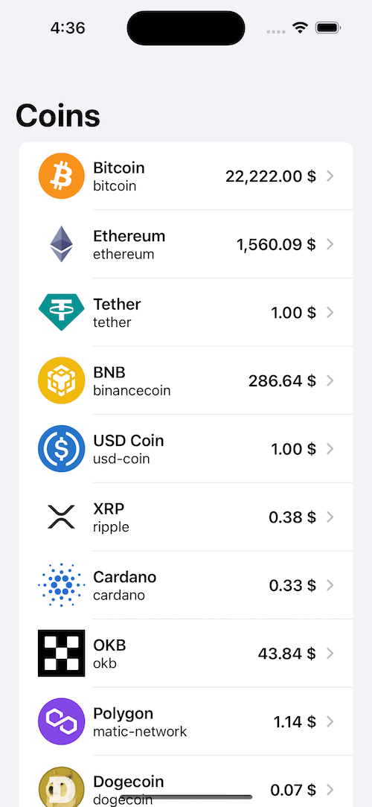

# ChatGPT-Crypto-App

This is an app that I created during a lecture I held at Zuehlke AG in Schlieren on the topic "ChatGPT for Software engineers". See in the description how I got to the result you see in this repo that was created JUS with the help of chatGPT and without writing a single line of code ... it took me 5 minutes

Under the screenshot you find the chat between me (My Prompt) and chatGPT (Jippy aka GP aka chatGPT)

## My prompt:
I want to create a SwiftUI app for iOS. I use the MVVM pattern.

Use the data that comes from the endpoint  https://api.coingecko.com/api/v3/coins/markets?vs_currency=usd&order=market_cap_desc&per_page=100&page=1&sparkline=true&price_change_percentage=1h%2C24h

Only the first 100 coins are of interest to me

On the main view I want to see a list of the coins. Each cell should show the icon of the coin on the left, then the name and the coin id right to the icon name in bold, below the coin id.

On the right I want to see the current price in USD (nicely formatted according to the coin's value)

## Jippy aka GP aka chatGPT:
Great! Here's an example implementation of the app you described, using SwiftUI and the MVVM pattern:

### Model
Create a Coin struct to represent the data that comes from the API endpoint.

            struct Coin: Codable {
                let id: String
                let name: String
                let symbol: String
                let image: String
                let currentPrice: Double
                
                enum CodingKeys: String, CodingKey {
                    case id, name, symbol, image
                    case currentPrice = "current_price"
                }
            }

Create a CoinListView to show a list of coins, with an Image, Text, and FormattedPrice view for each coin.

            struct CoinListView: View {
                @ObservedObject var viewModel: CoinListViewModel
                
                var body: some View {
                    NavigationView {
                        List(viewModel.coins) { coin in
                            NavigationLink(destination: CoinDetailView(coin: coin)) {
                                CoinRow(coin: coin)
                            }
                        }
                        .navigationTitle("Coins")
                    }
                }
            }

            struct CoinRow: View {
                let coin: Coin
                
                var body: some View {
                    HStack {
                        Image(uiImage: UIImage(data: try! Data(contentsOf: URL(string: coin.image)!))!)
                            .resizable()
                            .aspectRatio(contentMode: .fit)
                            .frame(width: 50, height: 50)
                        VStack(alignment: .leading) {
                            Text(coin.name)
                                .font(.headline)
                            Text(coin.id)
                                .font(.subheadline)
                        }
                        Spacer()
                        FormattedPrice(amount: coin.currentPrice)
                    }
                }
            }

            struct FormattedPrice: View {
                let amount: Double
                
                var body: some View {
                    Text(NumberFormatter.localizedString(from: NSNumber(value: amount), number: .currency))
                        .font(.headline)
                }
            }

### ViewModel
Create a CoinListViewModel to fetch the data from the API endpoint and store it in an array of Coin objects.

            class CoinListViewModel: ObservableObject {
                @Published var coins: [Coin] = []
                
                func fetchCoins() {
                    guard let url = URL(string: "https://api.coingecko.com/api/v3/coins/markets?vs_currency=usd&order=market_cap_desc&per_page=100&page=1&sparkline=true&price_change_percentage=1h%2C24h") 
                    else {
                        fatalError("Invalid URL")
                    }
                    
                    URLSession.shared.dataTask(with: url) { data, response, error in
                        guard let data = data else {
                            fatalError("Invalid Data")
                        }
                        do {
                            let coins = try JSONDecoder().decode([Coin].self, from: data)
                            DispatchQueue.main.async {
                                self.coins = coins
                            }
                        } catch {
                            fatalError("Failed to decode JSON")
                        }
                    }.resume()
                }
            }

### ContentView
Finally, create a ContentView that initializes the CoinListViewModel and fetches the data from the API endpoint.

            struct ContentView: View {
                @StateObject var viewModel = CoinListViewModel()
                
                var body: some View {
                    CoinListView(viewModel: viewModel)
                        .onAppear {
                            viewModel.fetchCoins()
                        }
                }
            }

That's it! This app should display a list of the top 100 coins from the CoinGecko API, with the coin name, ID, and current price in USD.

## My prompt:
**Error: Cannot find 'CoinDetailView' in scope**

## Jippy aka GP aka chatGPT:
I apologize for the mistake. To resolve the error, you can define CoinDetailView in your code as shown below:

            struct CoinDetailView: View {
                let coin: Coin
                
                var body: some View {
                    VStack {
                        Text(coin.name)
                            .font(.title)
                        Image(uiImage: UIImage(data: try! Data(contentsOf: URL(string: coin.image)!))!)
                            .resizable()
                            .aspectRatio(contentMode: .fit)
                            .frame(width: 100, height: 100)
                        FormattedPrice(amount: coin.currentPrice)
                    }
                }
            }

And then use the NavigationLink wrapper as shown in the original code:

            struct CoinRow: View {
                let coin: Coin
                
                var body: some View {
                    NavigationLink(destination: CoinDetailView(coin: coin)) {
                        HStack {
                            Image(uiImage: UIImage(data: try! Data(contentsOf: URL(string: coin.image)!))!)
                                .resizable()
                                .aspectRatio(contentMode: .fit)
                                .frame(width: 50, height: 50)
                            VStack(alignment: .leading) {
                                Text(coin.name)
                                    .font(.headline)
                                Text(coin.id)
                                    .font(.subheadline)
                            }
                            Spacer()
                            FormattedPrice(amount: coin.currentPrice)
                        }
                    }
                }
            }

I hope this helps! Let me know if you have any further questions.

## My prompt:
**Error: Initializer 'init(_:rowContent:)' requires that 'Coin' conform to 'Identifiable'**

## Jippy aka GP aka chatGPT:
I apologize for the confusion. You are correct that the List initializer with a closure requires the data type to conform to the Identifiable protocol. To fix the error, you can make the Coin struct conform to the Identifiable protocol:

            struct Coin: Codable, Identifiable {
                let id: String
                let name: String
                let symbol: String
                let image: String
                let currentPrice: Double
                
                enum CodingKeys: String, CodingKey {
                    case id, name, symbol, image
                    case currentPrice = "current_price"
                }
            }

With this change, the List initializer with a closure should work correctly. I hope this helps! Let me know if you have any further questions.

